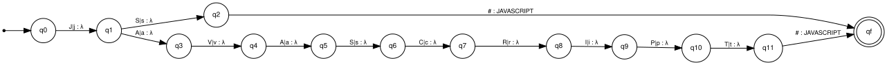

# Stage 2 — Normalization with finite-state transducers

Implementation: `resumelens/normalization.py` (pyformlang `FST`).
Complete 7-tuples of all transducers: [`generated/transducers.md`](generated/transducers.md).
Diagrams: `docs/diagrams/T_*.svg`.

## Idea

The same qualification is written in many ways (`JS`, `Javascript`,
`javascript`). A transducer reads the raw string **character by character** and
writes a single canonical symbol (`JAVASCRIPT`). There is one transducer per
category of the catalog:

| Transducer | Canonical tokens | Variants | \|Q\| | \|Σ\| | Transitions |
|---|---|---|---|---|---|
| T_LANGUAGES | 5 | 9 | 40 | 33 | 85 |
| T_FRAMEWORKS | 8 | 18 | 74 | 39 | 156 |
| T_DATABASES | 6 | 9 | 38 | 32 | 80 |
| T_ML_DATA | 6 | 11 | 96 | 45 | 193 |
| T_DEVOPS_CLOUD | 11 | 16 | 114 | 52 | 233 |
| T_TOOLS | 5 | 8 | 48 | 36 | 98 |

(Transitions count both letter cases separately; the diagrams merge them as
`a|A`.) The largest transducers are the ones with long variants such as
`amazon web services` or `predictive models`: every character of a variant that
does not share a prefix with another variant adds one state.

The transformations are **our own proposal** (the assignment table is included
and extended): e.g. `k8s → KUBERNETES`, `Amazon Web Services → AWS`,
`Google Cloud → GCP`, `GitLab-CI → GITLAB_CI`, `Ubuntu → LINUX`,
`PowerBI → POWER_BI`, `MS Excel → EXCEL`, `GitHub → GIT`.

## General definition

Following the course definition of a deterministic FST, each transducer is

M = (Q, Σ, Γ, δ, ω, q0, F)

* **Q** — one state per distinct prefix of the variants (the transducer is a
  *trie*), plus a final state `qf`.
* **Σ** — the characters used by the variants, **both cases of every letter**,
  plus the end marker `#`.
* **Γ** — the canonical tokens of the category.
* **δ : Q × Σ → Q** — `δ(q_u, c) = q_uc` when `uc` is a prefix of some variant
  (for letters, the lower- and the upper-case form lead to the same state);
  `δ(q_v, #) = qf` when `v` is a complete variant.
* **ω : Q × Σ → Γ ∪ {λ}** — `ω(q_u, c) = λ` for every character transition;
  `ω(q_v, #) = canonical(v)`.
* **q0** — the state of the empty prefix.
* **F = {qf}**.

The translation of a word `w` is defined iff `w#` leads from q0 to qf, and then
it is exactly one canonical token.

### Why the end marker `#`

Some variants are prefixes of others (`react` / `react.js`, `node` /
`node.js`, `git` / `github`). If the output were written on the last letter,
`react.js` would output `REACT` too early. Delaying the output to the `#`
transition means the transducer only decides after reading the whole string.
It also makes incomplete inputs (`Reac`, `Kubernete`) produce no output.

### Why case variants in δ and not `lower()` before

Case-insensitivity is part of the model (`JS`, `js`, `Js` are the same input
class). Putting both cases in Σ keeps the transformation fully inside the
transducer. The only preprocessing outside the FST is collapsing repeated blanks
and trimming final punctuation (`preprocess()`), which guarantees the input is a
word over Σ.

### Determinism

Because the transducer is a trie, every pair (q, a) has at most one successor
and there are no λ-input transitions: it is a **deterministic FST**
(`tests/test_normalization.py::test_transducers_are_deterministic`).

## Complete worked example: T_EXAMPLE_JAVASCRIPT

A reduced transducer with only `js → JAVASCRIPT` and `javascript → JAVASCRIPT`
(diagram `docs/diagrams/T_EXAMPLE_JAVASCRIPT.svg`):



* Q = {q0, q1, q2, q3, q4, q5, q6, q7, q8, q9, q10, q11, qf}
* Σ = {j, J, s, S, a, A, v, V, c, C, r, R, i, I, p, P, t, T, #}
* Γ = {JAVASCRIPT}
* q0 = q0, F = {qf}

| q | a | δ(q, a) | ω(q, a) |
|---|---|---|---|
| q0 | j, J | q1 | λ |
| q1 | s, S | q2 | λ |
| q2 | # | qf | JAVASCRIPT |
| q1 | a, A | q3 | λ |
| q3 | v, V | q4 | λ |
| q4 | a, A | q5 | λ |
| q5 | s, S | q6 | λ |
| q6 | c, C | q7 | λ |
| q7 | r, R | q8 | λ |
| q8 | i, I | q9 | λ |
| q9 | p, P | q10 | λ |
| q10 | t, T | q11 | λ |
| q11 | # | qf | JAVASCRIPT |

Run on `Js#`: q0 —J:λ→ q1 —s:λ→ q2 —#:JAVASCRIPT→ qf. Output: `JAVASCRIPT`.

## pyformlang implementation

```python
fst = FST()
fst.add_transition("q0", "J", "q1", [])            # ω = λ
fst.add_transition("q1", "S", "q2", [])
fst.add_transition("q2", "#", "qf", ["JAVASCRIPT"])
fst.add_start_state("q0"); fst.add_final_state("qf")
list(fst.translate(["J", "S", "#"]))               # [['JAVASCRIPT']]
```

`Normalizer.translate()` tries first the transducer of the category detected in
Stage 1 and then the others. Strings that no transducer accepts are reported in
`NormalizationResult.unrecognized`.

## Sorting the output

After normalization, `Profile.canonical_sequence()` removes duplicates, keeps
only tokens of the profile alphabet and sorts by (slot index, position inside
the slot). Example from the assignment:

```
Git, NodeJS, JS, Postgres, React.js
→ (FST) GIT, NODE_JS, JAVASCRIPT, POSTGRESQL, REACT
→ (Full Stack order: frontend → backend → database → version control)
  JAVASCRIPT, REACT, NODE_JS, POSTGRESQL, GIT
```

Sorting is what makes a linear automaton sufficient in Stage 3: without it, the
automaton would need to accept every permutation of the required skills.
